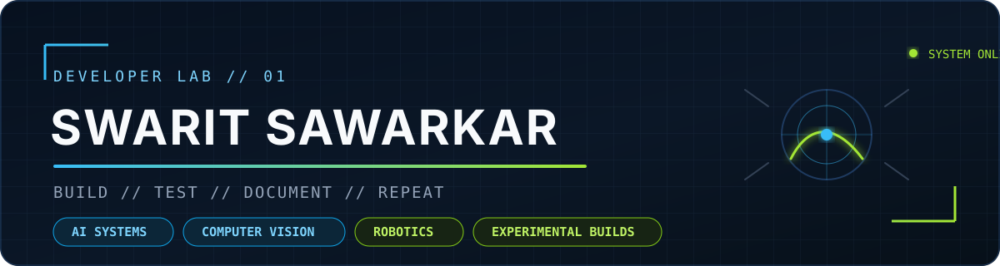
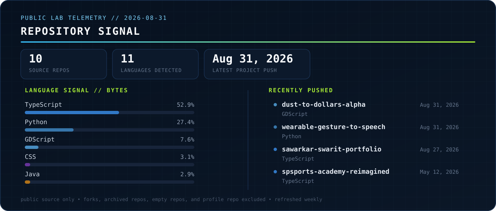

  

  <a href="https://sawarkarswarit.netlify.app">Portfolio</a>
  &nbsp;·&nbsp;
  <a href="https://github.com/swaritsawarkar?tab=repositories">Repositories</a>
  &nbsp;·&nbsp;
  <a href="https://github.com/swaritsawarkar/wearable-gesture-to-speech">Current assistive-tech prototype</a>

## Workbench

I build practical experiments where software meets the physical world: computer-vision tools, assistive prototypes, creator utilities, and small games. I care about runnable builds, visible evidence, and stating the limits instead of dressing a prototype up as a finished product.

<table>
  <tr>
    <td width="50%" valign="top">
      <h3><a href="https://github.com/swaritsawarkar/wearable-gesture-to-speech">Wearable Gesture-to-Speech</a></h3>
      
A pre-alpha Windows prototype for personalized gesture-to-speech: MediaPipe tracking, guided training, DTW recognition, a Tkinter UI, and 3D-printable mount concepts.

      
<strong>Boundary:</strong> a custom gesture system, not a validated ISL translator. Hardware concepts still require physical fit testing.

      
<code>Python</code> <code>MediaPipe</code> <code>OpenCV</code> <code>OpenSCAD</code>

    </td>
    <td width="50%" valign="top">
      <h3><a href="https://github.com/swaritsawarkar/dust-to-dollars-alpha">Dust to Dollars</a></h3>
      
A pixel-art resale and negotiation game built in Godot. The loop covers buying, inspecting, restoring, pricing, and negotiating, with offline fallback and optional AI buyer dialogue.

      
Alpha build with a documented local run path and real in-game screenshots.

      
<code>Godot 4.7</code> <code>GDScript</code> <code>Python</code>

    </td>
  </tr>
  <tr>
    <td width="50%" valign="top">
      <h3><a href="https://github.com/swaritsawarkar/minemarker">MineMarker</a></h3>
      
A Minecraft creator editing assistant: a Fabric client mod records markers and events, while a local Electron/React viewer turns session files into editing notes and review exports.

      
File-based workflow; editor-native marker imports and OBS WebSocket sync are not claimed.

      
<code>Java</code> <code>Fabric</code> <code>React</code> <code>Electron</code>

    </td>
    <td width="50%" valign="top">
      <h3><a href="https://github.com/swaritsawarkar/attentiondropdetector">Attention Drop Detector</a></h3>
      
A pre-publish video analyzer that scores face, motion, audio, and cut signals, then flags likely drop zones through a dark local web UI.

      
Heuristic scoring, not a model trained on real audience-retention data.

      
<code>Python</code> <code>OpenCV</code> <code>MediaPipe</code> <code>Flask</code>

    </td>
  </tr>
</table>

### More field tests

- [10thHoJayega](https://github.com/swaritsawarkar/10thHoJayega) — a Class 10 CBSE/NCERT progress tracker with Supabase auth, focus sessions, print workflows, and optional AI homework help.
- [Chess Tracker](https://github.com/swaritsawarkar/chesstrackerpy) — camera calibration and physical-board move detection with Stockfish analysis and PGN export.

## Public lab telemetry

  

Generated weekly from public GitHub repository metadata. Forks, archived repositories, and this profile repository are excluded. Language percentages use GitHub's byte totals.

## Contribution trail

  <picture>
    <source media="(prefers-color-scheme: dark)" srcset="https://raw.githubusercontent.com/swaritsawarkar/swaritsawarkar/output/github-contribution-grid-snake-dark.svg" />
    <source media="(prefers-color-scheme: light)" srcset="https://raw.githubusercontent.com/swaritsawarkar/swaritsawarkar/output/github-contribution-grid-snake.svg" />
    
  </picture>

The snake reads GitHub's real contribution graph. Workflow refreshes are authored by GitHub Actions, not used to manufacture personal activity.

